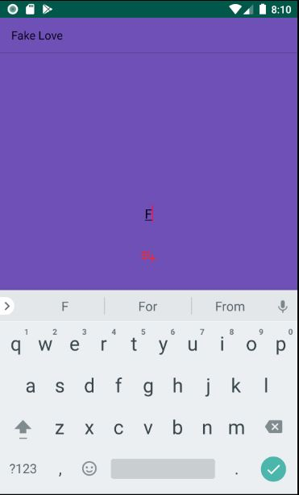
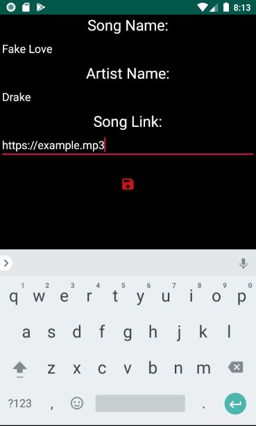
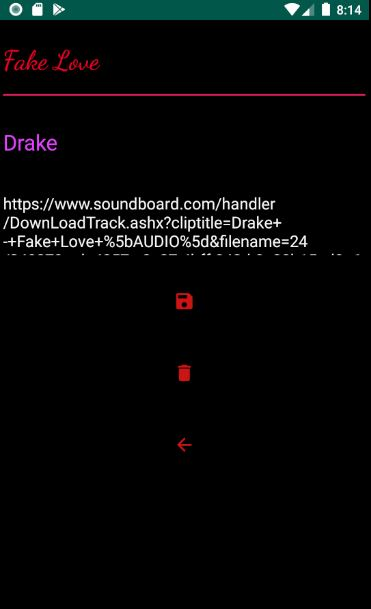

# Assignment 2 - Music Player

### Pixel 2 API 26
### Note: The github repository changes the package name once its cloned. all android files must be in folder called MusicPlayer for the application to run properly.

#### Home screen

#### Search Screen

#### Add song screen

#### View song screen

#### Edit song screen

#### Music Player Screen

