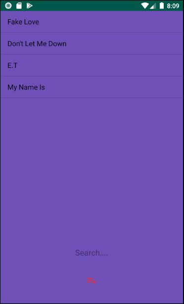
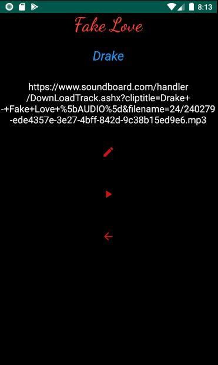

# Assignment 2 - Music Player

### Pixel 2 API 26
### Note: The github repository changes the package name once its cloned. all android files must be in folder called MusicPlayer for the application to run properly.

### Song Links used:
1. Fake Love - https://www.soundboard.com/handler/DownLoadTrack.ashx?cliptitle=Drake+-+Fake+Love+%5bAUDIO%5d&filename=24/240279-ede4357e-3e27-4bff-842d-9c38b15ed9e6.mp3

2. Don't let me down - https://www.soundboard.com/handler/DownLoadTrack.ashx?cliptitle=Don%27t+Let+Me+Down-+The+Chainsmokers+ft.+Daya+Lyrics&filename=24/240279-f3731cbc-f3b3-44a9-8b23-591267ae9937

3. E.T - https://www.soundboard.com/handler/DownLoadTrack.ashx?cliptitle=Katy+Perry+-+E.T.+ft.+Kanye+West&filename=24/240279-12b4ddd3-86b8-4ae2-835b-26a7d2944727.mp3

4. My Name Is - https://www.soundboard.com/handler/DownLoadTrack.ashx?cliptitle=Eminem+-+My+Name+Is&filename=24/240279-9af6b3eb-3029-460c-aab2-27f1ffbaae9d.mp3

#### Home screen

#### Search Screen

#### Add song screen

#### View song screen

#### Edit song screen

#### Music Player Screen

